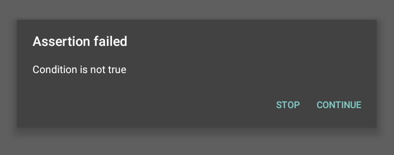

#AssertDialog
C#-like assert dialog.
Shows modal dialog when assertion fails, blocking current thread.



Min SDK version - 14

Usage
-----

First you have to init it. Preferable place to do that, is your applicaion onCreate() method.
```java
    @Override
    public void onCreate() {
        super.onCreate();
        AssertDialog.init(true, getApplicationContext());
    }
```

After that, it behaves similar to JUnit Asserts
```java
    private void updateUser(int userId)  {
        AssertDialog.assertTrue(userId > 0, "Trying to update user with id <= 0");
        AssertDialog.assertTrue(isUserExists(userId));
	....
    }
```

License
-------

Copyright 2015 Aleksey Kurnosenko

Licensed under the Apache License, Version 2.0 (the "License");
you may not use this file except in compliance with the License.
You may obtain a copy of the License at

   http://www.apache.org/licenses/LICENSE-2.0

Unless required by applicable law or agreed to in writing, software
distributed under the License is distributed on an "AS IS" BASIS,
WITHOUT WARRANTIES OR CONDITIONS OF ANY KIND, either express or implied.
See the License for the specific language governing permissions and
limitations under the License.
